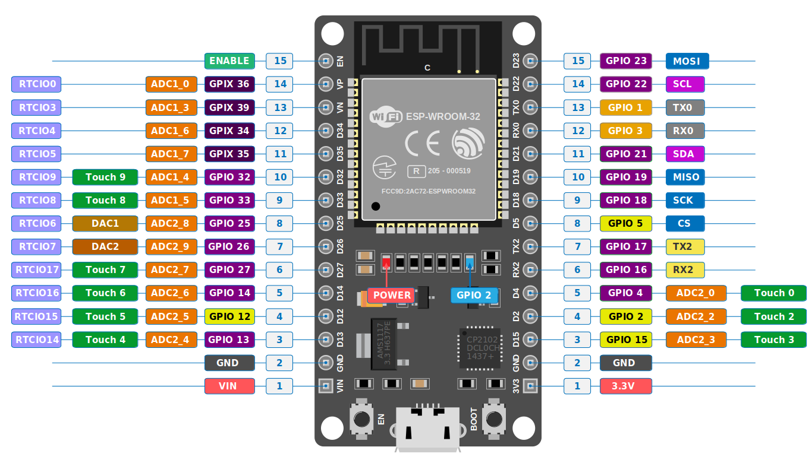

## Programming With ESP32 Kit:

### ESP32-DevKit-V1 Pinout and Arduino IDE Mapping

Below are the detailed pin configurations separated into the left and right sides of the board. When writing code in the Arduino IDE, always use the **Arduino IDE Pin Number**.

#### Left Side Pins

| Board Label | Arduino IDE Pin Number | Pin Type | Functions & Capabilities |
| :--- | :--- | :--- | :--- |
| **EN** | - | Power/Control | Chip enable / Reset pin |
| **VP** | 36 | Input Only | ADC1_0, RTCIO0 |
| **VN** | 39 | Input Only | ADC1_3, RTCIO3 |
| **D34** | 34 | Input Only | ADC1_6, RTCIO4 |
| **D35** | 35 | Input Only | ADC1_7, RTCIO5 |
| **D32** | 32 | Input / Output | ADC1_4, Touch 9, RTCIO9 |
| **D33** | 33 | Input / Output | ADC1_5, Touch 8, RTCIO8 |
| **D25** | 25 | Input / Output | ADC2_8, DAC1, RTCIO6 |
| **D26** | 26 | Input / Output | ADC2_9, DAC2, RTCIO7 |
| **D27** | 27 | Input / Output | ADC2_7, Touch 7, RTCIO17 |
| **D14** | 14 | Input / Output | ADC2_6, Touch 6, RTCIO16 |
| **D12** | 12 | Input / Output | ADC2_5, Touch 5, RTCIO15 |
| **D13** | 13 | Input / Output | ADC2_4, Touch 4, RTCIO14 |
| **GND** | - | Power | Common Ground |
| **VIN** | - | Power | Input Voltage (5V via USB) |

---

#### Right Side Pins

| Board Label | Arduino IDE Pin Number | Pin Type | Functions & Capabilities |
| :--- | :--- | :--- | :--- |
| **D23** | 23 | Input / Output | MOSI (SPI Communication) |
| **D22** | 22 | Input / Output | SCL (I2C Communication) |
| **TX0** | 1 | Input / Output | TX0 (UART0 Transmit) |
| **RX0** | 3 | Input / Output | RX0 (UART0 Receive) |
| **D21** | 21 | Input / Output | SDA (I2C Communication) |
| **D19** | 19 | Input / Output | MISO (SPI Communication) |
| **D18** | 18 | Input / Output | SCK (SPI Communication) |
| **D5** | 5 | Input / Output | CS (SPI Communication) |
| **TX2** | 17 | Input / Output | TX2 (UART2 Transmit) |
| **RX2** | 16 | Input / Output | RX2 (UART2 Receive) |
| **D4** | 4 | Input / Output | ADC2_0, Touch 0 |
| **D2** | 2 | Input / Output | ADC2_2, Touch 2 (Internal Blue LED) |
| **D15** | 15 | Input / Output | ADC2_3, Touch 3 |
| **GND** | - | Power | Common Ground |
| **3V3** | - | Power | 3.3V Power Output |