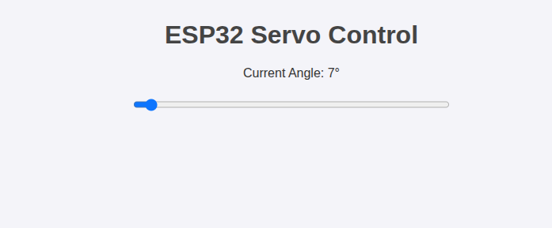

## Controlling Angle of Mini Servo Motor (SG90) through Web Application:

## 1. Servo SG90 Motor Pin Configuration:

- **Red Wire** -> Connected to ESP32 5V **VIN** pin.

- **Brown Wire** -> Connected to ESP32 **GND** pin.

- **Orange Wire** -> Connected to ESP32 **GPIO** Pin. In this case connected to **D27** pin.

## Wireless Configuration

- IP assigned to esp32 on a wlan is displayed on a serial console.  Baud rate **115200**.

## Expose to ngrok globally

- To forward port to ngrok: `ngrok http <ESP32_IP>:80`
